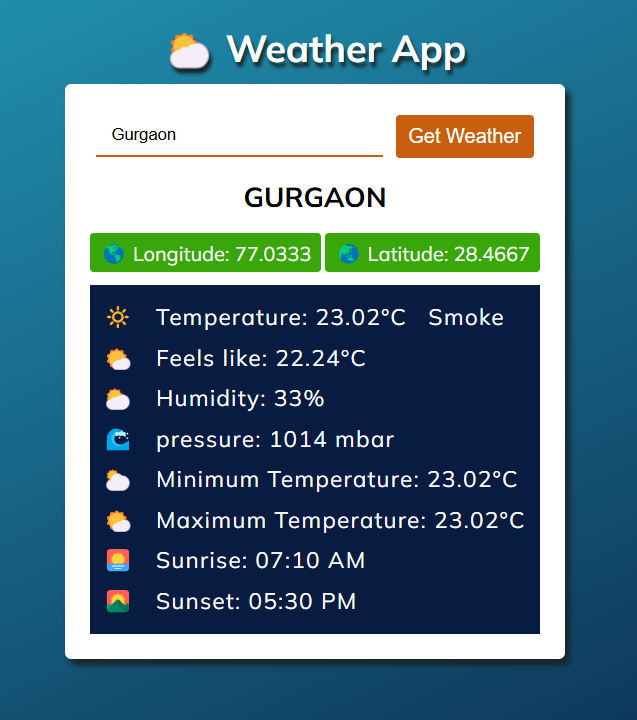

# Weather Tracker Web Application

## Overview

Weather Tracker is a simple, responsive web application that allows users to check current weather conditions and forecasts for any city around the world using a third-party weather API.

## Features

- Real-time weather data retrieval
- City-based weather search
- Display of key weather metrics:
  - Temperature (Celsius)
  - Humidity
  - Wind speed
  - Weather conditions (sunny, cloudy, rainy, etc.)
  - Sunrise and sunset times
  - Longitude and Latitude

## Screenshots

## Tech Stack

- HTML
- CSS
- JavaScript

## How to Use

1. Open the `index.html` file in your web browser.
2. Enter the name of the city you want to check the weather for in the search input field.
3. Click the "Get Weather" button.
4. The weather information for the specified city will be displayed.

## API Reference

This application uses the OpenWeatherMap API to fetch weather data. You can find more information about the API [here](https://openweathermap.org/api).

## License

This project is licensed under the MIT License.
